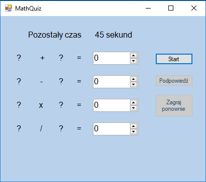

# MathQuiz
Prosty quiz matematyczny.

Quiz został napisany w języku C# Windows Froms.

Zakres funkcjonalności quizu:
- losowanie liczb do działań z zakresu 1 - 100
- podpowiedź - uzupełnia losowy wynik, jedna na cały quiz
- możliwość ponownej rozgrywki
- quiz posiada limit czasowy

Doskonały do zabawy oraz edukacji :-)
